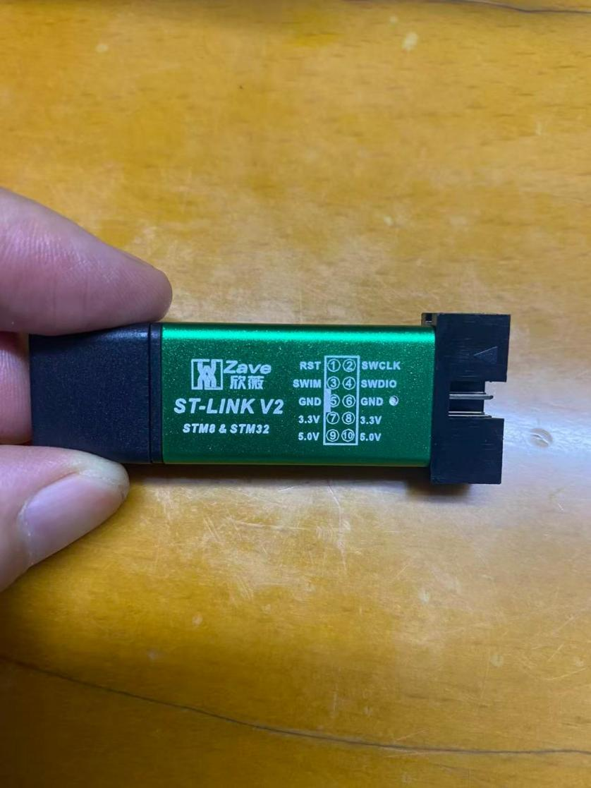
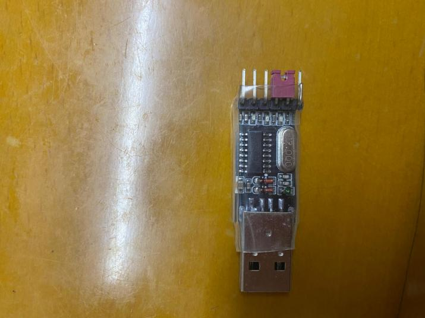
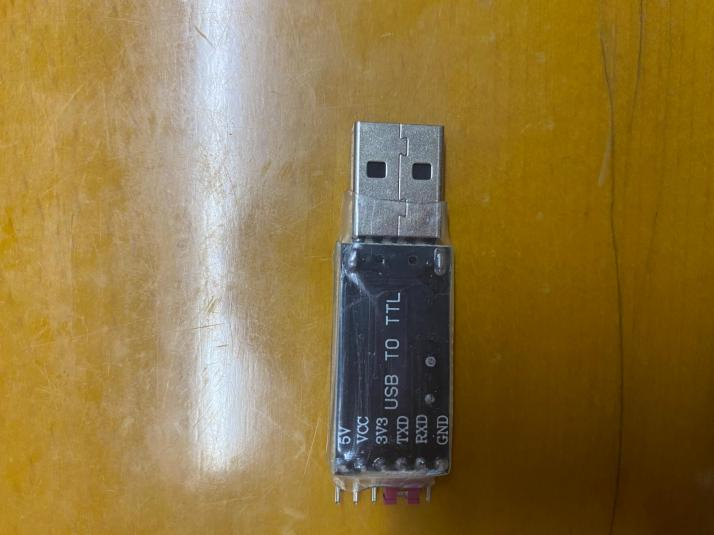
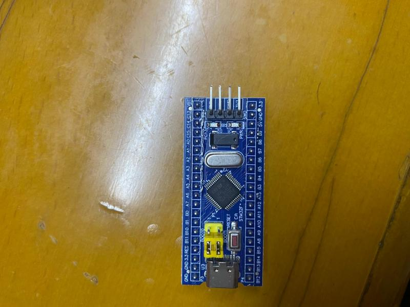

# Day 01 - GPIO 点灯学习笔记

> 学习日期：2026-07-12

## 电灯程序

### 组件一：ST-LINK-32

#### 图片

#### 说明
位置
针脚名称
作用（通俗解释）
上排 1
RST
复位引脚。拉低它，芯片就相当于按了“重启键”，程序从头跑。
上排 2
SWIM
STM8 烧录口。如果你的板子是 STM8 芯片（不是 STM32），就用这根线下载程序。
上排 3
SWDIO
STM32 数据口。这是 STM32 的灵魂，程序代码（0和1）就是通过这根线串行传进引脚的。
上排 4
GND
地线（0V）。所有电压的参考基准，必须接。
上排 5
GND
地线（0V）。和上面是通的，用来给排线提供更多回路。
下排 1
STM8 & STM32
标识位/兼容指示。通常这是“方向识别”或“电压适配”脚，表示这个接口同时兼容这两种芯片。
下排 2
3.3V
3.3V 电源输出。下载器可以通过这个脚给开发板供电（最大约 100mA）。
下排 3
5.0V
5.0V 电源输出。下载器可以通过这个脚给 5V 的外设供电。
下排 4
3.3V
另一个 3.3V 电源输出。
下排 5
5.0V
另一个 5.0V 电源输出。

#### 作用：
它帮你完成从“电脑代码”到“物理电灯”的最后一步：
下载程序：你在电脑上编译好的 .hex 或 .bin 文件（点灯代码），通过 ST-Link 下载器，经这个接口的 SWDIO 线，写入 STM32 芯片的内部 Flash（硬盘）中。
在线调试（Debug）：你可以像在 Java 的 IDEA 里打断点一样，让程序在这个接口的帮助下停在某一行，查看此时 GPIO 寄存器的值（比如 PA5 是不是真的变成了 0V）。

### 组件二：基于 CH340 芯片的 USB 转 TTL 串口模块

#### 图片

#### 说明
CH340芯片：
主要用于连接电脑和单片机（如 Arduino、ESP32、STM32 等）进行程序下载、调试或通信
引脚功能说明：
5V：USB 提供的 5V 电源输出（可直接给 5V 单片机上电）。
VCC：供电引脚（图中紫红色跳线帽将它和 5V 短接了，等同于输出 5V）。
3V3：USB 转换出的 3.3V 电源输出。
TXD：串口发送端。
RXD：串口接收端。
GND：地线（共地必需）。
最核心的接线规则
一：交叉连接
（TX 接 RX，RX 接 TX）：这是新手的重灾区！
本模块的 TXD ➡️ 接 目标设备的 RX
本模块的 RXD ➡️ 接 目标设备的 TX
二：共地（GND 接 GND）
必须将模块的 GND 和目标设备的 GND 连在一起，否则通信失败。
三：电压匹配
安全红线：千万不要用 5V 引脚给 3.3V 的单片机（如 ESP32、ESP8266、STM32F103）供电，会直接烧毁单片机！
如果目标设备是 3.3V 逻辑电平，请拔掉紫色跳线帽，用模块的 3V3 引脚给单片机供电，并由目标设备自身提供 3.3V 参考电平。
如果目标设备是 5V 逻辑电平（如 Arduino Uno 带 5V 芯片的版本），可以保持跳线帽插着，直接使用 5V 引脚供电。

### 组件三：STM32F103C8T6 最小系统板

#### 图片：

#### 说明：
硬件核心规格
主控芯片：STM32F103C8T6（ARM Cortex-M3 内核，主频最高 72MHz）。
存储空间：64KB Flash（程序空间），20KB SRAM（运行内存）。
供电：支持 5V 或 3.3V 供电（板载 LDO 稳压芯片将 5V 转换为 3.3V 给芯片核心供电）。
板载资源解析
从图片特征来看，这块板子的布局如下：
USB 接口：板子左侧的 Micro-USB（通常只用作供电，或者配合板子上可能集成的 CH340 芯片做串口调试使用。但注意：绝大多数这种板子不能直接插上 USB 就完成程序烧录）。
引导跳线（BOOT0）：左上角的黄色跳线帽。通过改变 BOOT0 的高低电平，可以控制单片机上电后从哪个位置启动（Flash、系统存储器、或 SRAM）。通常给芯片下载程序时，会用到这个跳线配合串口。
按键：左下方的 RESET（复位）按钮。
调试接口（SWD）：这是最核心的烧录引脚！ 从反面（图2）可以看到左侧有 4 个非常明显的焊盘或排针孔：SWDCLK、SWDIO、3V3、GND。
引脚引出：上下两排金属排针，把单片机所有的 GPIO 引脚（PA0~PA15, PB0~PB15，以及部分 PC 引脚）都引出来了，方便您外接屏幕、电机、传感器等模块。

### 接线：
ST-Link 下载器端杜邦线STM32 板子端 (图2侧面)核心要点
3.3V--->3V3供电。给单片机提供 3.3V 电压。
GND--->GND共地。绝对不能接错，否则无法通信。
SWDIO--->SWDIO数据线。
SWCLK--->SWDCLK时钟线。

### 基于：Keil uVision5 实现代码

#### 代码框架：

#### 代码主体
#include "stm32f10x.h"                  // Device header
// 以下是注释掉的寄存器操作版本（不推荐新手直接使用，效率虽高但可读性差）
//RCC->APB2ENR = 0x00000010;         // 直接操作寄存器：使能 GPIOC 端口的时钟
//GPIOC->CRH = 0x00300000;           // 直接操作寄存器：配置 PC13 为推挽输出模式（CRH控制高8位引脚）
//GPIOC->ODR = 0x00000000;           // 直接操作寄存器：设置输出数据寄存器为 0（低电平）
int main(void)                          // 主函数，程序的入口
{
  RCC_APB2PeriphClockCmd(RCC_APB2Periph_GPIOC,ENABLE); // 1. 调用库函数，开启 GPIOC 端口的时钟（不开启时钟，引脚无法工作）
  GPIO_InitTypeDef GPIO_InitStructure;                  // 2. 定义一个 GPIO 初始化结构体变量，用于存放引脚配置参数
  GPIO_InitStructure.GPIO_Mode=GPIO_Mode_Out_PP;        // 3. 设置引脚模式为：通用推挽输出（可以输出高低电平，驱动能力较强）
  GPIO_InitStructure.GPIO_Pin=GPIO_Pin_13;              // 4. 指定要配置的引脚是：GPIO 端口 C 的第 13 号引脚（PC13）
  GPIO_InitStructure.GPIO_Speed=GPIO_Speed_50MHz;       // 5. 设置引脚的翻转响应速度为：50MHz（STM32引脚最高可支持50MHz的高速信号翻转）
  GPIO_Init(GPIOC,&GPIO_InitStructure);                 // 6. 调用库函数，将刚才配置好的结构体参数，应用到实际的 GPIOC 端口上
  GPIO_SetBits(GPIOC,GPIO_Pin_13);                      // 7. 将 PC13 引脚的电平置为 高电平（1）。（*注意：这块板子的板载 LED 通常是低电平点亮，所以这行代码实际上是熄灭LED*）
//GPIO_ResetBits(GPIOC,GPIO_Pin_13);                  // 8. （被注释掉的代码）如果将前面的 GPIO_SetBits 注释掉，改用这行 ResetBits，则会把 PC13 置为低电平（0），从而 点亮 板载 LED。
while(1)                                            // 9. 死循环。程序运行到这里后会一直在这里空转，保证单片机的程序不退出、不跑飞，同时让上面的引脚状态一直保持。
{}
}

#### 代码框架说明：
【启动层】startup_stm32f10x_md.s
作用：这是单片机上电后运行的第一个文件。它负责配置堆栈指针、设置中断向量表，然后最后负责跳转到 main.c 中的 main() 函数。不需要你修改，只要知道它是“看门大爷”就行。
【驱动层】stm32f10x_rcc.c 和 stm32f10x_gpio.c 等
作用：这是官方提供给我们用的标准库，封装好了底层寄存器的操作。它们就像是工具箱，今天我们用到了里面的 RCC（时钟控制工具）和 GPIO（引脚控制工具）这两个工具包。
【应用层】main.c
作用：你今天唯一真正要写代码的文件。单片机的核心逻辑、电灯开关，都在这里编排

#### 助记口诀：
先开电（RCC）、再定岗（Init）、最后拨开关（Set/Reset），死循环保龙套。
#include "stm32f10x.h"                  // 核心头文件（必须包含）
int main(void)
{
    // 第1步：开电闸（开启引脚时钟，否则不干活）
    RCC_APB2PeriphClockCmd(RCC_APB2Periph_GPIOC, ENABLE); 
    // 第2步：定属性（配置引脚模式、速度）
    GPIO_InitTypeDef GPIO_InitStructure;                 // ① 准备一个配置结构体
    GPIO_InitStructure.GPIO_Mode = GPIO_Mode_Out_PP;     // ② 设置模式：推挽输出（就像普通双向开关）
    GPIO_InitStructure.GPIO_Pin = GPIO_Pin_13;           // ③ 指定引脚：PC13（看你板子背面的丝印）
    GPIO_InitStructure.GPIO_Speed = GPIO_Speed_50MHz;    // ④ 设置速度：50MHz（反应最快）
    GPIO_Init(GPIOC, &GPIO_InitStructure);               // ⑤ 应用配置：写入芯片寄存器
    // 第3步：拧开关（输出高电平或低电平）
    GPIO_SetBits(GPIOC, GPIO_Pin_13);  // 输出 高电平 (1)
    // GPIO_ResetBits(GPIOC, GPIO_Pin_13); // 输出 低电平 (0)
    // 第4步：死循环（保持状态不退出）
    while(1)
    {}
}

#### 核心原理：
你要记住，我们写代码，不是在画一个灯，而是在控制一个物理开关。
关于时钟（RCC）：单片机的内部电路非常省电，默认大部分外设是断电的。我们要用 RCC_APB2PeriphClockCmd 这行代码，先给 GPIOC 这个端口通上电。没这行代码，引脚直接罢工。
关于推挽输出（GPIO_Mode_Out_PP）：这相当于把单片机的内部晶体管配置成了“开关”。推挽模式最常用，因为它既能输出强劲的高电平（推），也能瞬间输出低电平（拉），驱动能力最强。
关于高低电平与板子电路（核心难点！）：你的这块开发板，LED灯和电源正极相连，然后串联一个电阻，连接到单片机的 PC13 引脚。这叫“共阳极接法”。
高电平（3.3V） -> 引脚和电源电压一样，没有电流流过 -> 灯灭（你现在的代码就是灭的）。
低电平（0V） -> 引脚是地的电位，电流从3.3V流向PC13引脚（流进芯片内部） -> 灯亮。
关于 while(1)：如果没有这个死循环，CPU 执行完 main 函数最后一行后，程序就会崩溃跑飞。while(1) 让 CPU 一直在这个循环里原地踏步，从而让刚才设置的引脚电平一直保持住。

