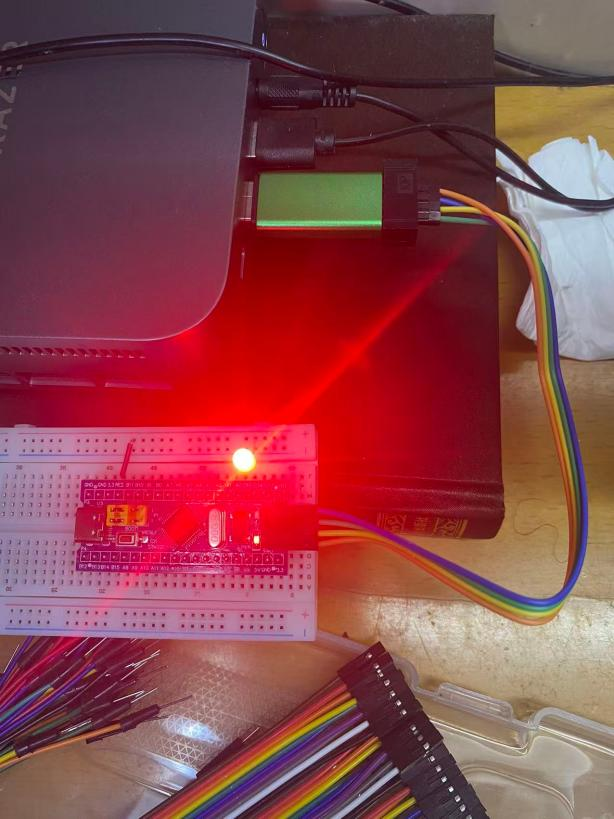
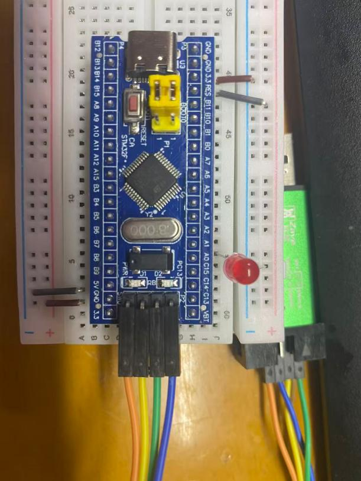

# Day 02 - 跑马灯学习笔记

> 学习日期：2026-07-13

## 跑马灯

### RCC

#### 说明：
复位和时钟控制

#### 作用：
总电闸（供电控制）：
总电闸（供电控制）:RCC 控制着大楼里每一个“房间”（外设，如 GPIO、串口、定时器）的电源开关。在系统刚上电时，所有的外设房间默认都是“拉闸断电”的，这么做是为了省电。
心跳发生器（同步节拍）：
心跳发生器（同步节拍）:数字电路必须有“时钟”（就像电脑的 CPU 频率），RCC 负责给整栋大楼提供统一的“心跳节拍”。没有心跳，所有的逻辑门都无法运作。

### 频率

#### 说明：
指的是单片机的单片机的节拍器”或“心跳”，每秒转动多少次

#### 作用：
决定灯的闪烁快慢（时间控制）
如果你以后想写一个“闪烁灯”，你需要用到延时函数（Delay）。这个延时的时间是怎么算出来的？全靠频率！
原理：单片机内部有个定时器，它每“跳动”一次（比如 72MHz = 一秒跳 7200万次），就能让你精准地知道经过了 1微秒、1毫秒。
2决定串口发信息快慢（波特率）
当你以后用那个 CH340 USB转TTL 模块连接电脑时。
你会配置一个叫 “波特率”（比如 115200）的东西，意思是每秒传输 115200 个位。
决定单片机“累不累”（功耗）
72MHz 跑得虽快，但跑得越快，内部晶体管翻转的次数就越多，耗电也越大

### system启动方法源码：

#### 源码及注释
#include "stm32f10x.h"
#include "system_stm32f10x.h"
// ==========================================
// 💡 【系统时钟原理与设计哲学】
//
// 1. 为什么需要外部晶振（HSE）？
//    芯片内部自带一个 RC 振荡器（HSI，约8MHz）。但受硅晶圆物理制造工艺所限，
//    内部 RC 振荡器受温度、电压影响极大，误差通常在 ±1% ~ ±2.5%。
//    就好比“电子表”，便宜但走时不准。
//
// 2. 外部晶振（HSE）的优点：
//    板上外接 8MHz 石英晶振。石英晶体具有极高的压电物理稳定性，
//    就像“劳力士机械表”，极其精准，误差极小（ppm级别）。
//
// 3. 上电时的设计逻辑（最重要）：
//    单片机刚上电时，为了能快速启动，**先用内部 HSI（电子表）活着**。
//    随后在代码中发起向“高精度 HSE”的切换。
//    如果外部石英晶振坏掉或没焊接，单片机就会停在“等待稳定”的循环中。
// ==========================================
// 这里的宏定义了倍频目标为 72MHz
#define SYSCLK_FREQ_72MHz  72000000 
// 核心时钟配置函数（SystemInit 的底层实现）
static void SetSysClock(void)
{
    // 1. 使能外部高速晶振 (HSE 8MHz)
    // 【核心知识点】：告诉单片机“不用再依赖内部很差的RC振荡器，
    // 去接通外面板子上的那个高精度石英晶振！”
    RCC->CR |= ((uint32_t)RCC_CR_HSEON); 
    // 2. 死循环等待外部晶振稳定 (如果晶振坏了，程序会卡死在这里)
    // 外部石英晶振通电后需要几毫秒的时间才能稳定起振。
    // 单片机在这里“不敢动”，直到读到外部晶振完全稳定的信号（HSERDY）才会退出。
    while(!(RCC->CR & RCC_CR_HSERDY));
    // 3. 配置电源的 Flash 预取缓存 (主频高了必须要配，否则读取代码会死机)
    // -------------------------------------------------------------
    // 🔴 核心原理：【神速读者与纸质书的妥协】
    // CPU（大脑）跑到了72MHz（每秒7200万次），但是存放代码的 Flash（闪存）
    // 读取速度比较慢。CPU去取指令时，必须停下来“等一等”慢速的 Flash。
    // 
    // 📏 等待周期（LATENCY）配速规则：
    //   - 主频 0~24MHz ：0个等待周期（不等待）
    //   - 主频 24~48MHz：1个等待周期（等1拍）
    //   - 主频 48~72MHz：2个等待周期（等2拍） <--- 我们现在是72MHz，所以写2
    // 
    // 🚀 加速神器（PRFTBE）：
    // 单纯的等待太浪费性能。STM32 内部有个“预取缓冲区”，
    // 它会在 CPU 执行当前指令时，提前把下面要用的代码提前抓进高速缓存里。
    // 这样 CPU 就几乎不用再去慢速的 Flash 里读数据了！
    //
    // ⚠️ 致命警告：如果忘了写这一行（或等待周期写少了），在72MHz下，
    // CPU 读到的全是“错乱的乱码代码”，单片机 100% 会直接死机或重启！
    // -------------------------------------------------------------
    FLASH->ACR = FLASH_ACR_PRFTBE | FLASH_ACR_LATENCY_2; 
    // 4. 配置 AHB, APB1, APB2 总线的分频系数
    // 这是 STM32 经典的“黄金比例”分配
    RCC->CFGR |= RCC_CFGR_HPRE_DIV1;   // AHB = SYSCLK = 72MHz
    RCC->CFGR |= RCC_CFGR_PPRE2_DIV1;  // APB2 = HCLK = 72MHz (高速外设，你点灯用的 GPIO 就在这里)
    RCC->CFGR |= RCC_CFGR_PPRE1_DIV2;  // APB1 = HCLK/2 = 36MHz (低速外设，降速省电)
    // 5. 配置 PLL (锁相环)：输入源为HSE(8MHz)，倍频系数为 9
    // -------------------------------------------------------------
    // ⚙️ 步骤一：【擦黑板】清空旧配置
    // 为什么不能直接写，而要先用 `&= ~(...)`？
    // 因为这个寄存器的其他位刚刚被配置成了 AHB=72 和 APB1=36。
    // 用 `=` 直接赋值会毁掉前面的配置。
    // 所以必须用位运算，只擦除控制 PLL 的专用位，而不影响其他无关的位。
    // -------------------------------------------------------------
    RCC->CFGR &= (uint32_t)((uint32_t)~(RCC_CFGR_PLLSRC | RCC_CFGR_PLLXTPRE |
                                        RCC_CFGR_PLLMULL));
    // ⚙️ 步骤二：【写配置】将 8MHz 输入和倍频 9 写入
    // 此时黑板已经被擦干净了，下面这一行 `|=` 只会把对应的位写成1。
    // 硬件数学计算：8MHz (外部HSE) × 9 (倍频系数) = 72MHz (系统主频 SYSCLK)
    // -------------------------------------------------------------
    RCC->CFGR |= (uint32_t)(RCC_CFGR_PLLSRC_HSE | RCC_CFGR_PLLMULL9); 
    // ⚠️ 【致命大坑预警！】
    // 你的这块开发板外部晶振确实是 8MHz，乘以 9 等于 72MHz，完美。
    // 但是，市面上有的 STM32 开发板（比如某些新塘或国产替换版），
    // 外置晶振可能是 12MHz 或 16MHz！
    // 如果你拿这段代码直接去跑 12MHz 晶振的板子，数学计算会变成：
    // 12MHz × 9 = 108MHz -> 芯片超频，必定发热死机甚至烧毁！
    // 以后移植到新板子时，**第一步必须先检查外部晶振到底是多少MHz！**
    // -------------------------------------------------------------
    // 6. 使能 PLL
    RCC->CR |= RCC_CR_PLLON;
    while((RCC->CR & RCC_CR_PLLRDY) == 0); // 等待PLL内部电路稳定
    // 7. 将 PLL 配置为系统的时钟源 (切换至此前的8MHz变成72MHz)
    RCC->CFGR &= (uint32_t)((uint32_t)~(RCC_CFGR_SW));
    RCC->CFGR |= (uint32_t)RCC_CFGR_SW_PLL;
    while((RCC->CFGR & (uint32_t)RCC_CFGR_SWS) != (uint32_t)0x08); // 等待切换完成
}
// 我们常写的 SystemInit 底层实际执行者
void SystemInit(void)
{
    // 复位 RCC 寄存器到默认状态，清除之前的杂乱配置（强制归零，防止异常）
    RCC->CR |= (uint32_t)0x00000001;
    RCC->CFGR &= 0xF8FF0000;
    RCC->CR &= 0xFEF6FFFF;
    RCC->CR &= 0xFFFBFFFF;
    RCC->CFGR &= 0xFF80FFFF;
    RCC->CIR = 0x00000000;
    // 调用上面的配置函数，完成 72MHz 的倍频
    SetSysClock();
}

### 4：完整代码：
// 手动定义简易延时函数（因标准库无内置delay）
void delay_ms(unsigned int ms) 
{
    unsigned int i, j;
    for(i = 0; i < ms; i++)
        for(j = 0; j < 8000; j++); // 通过空转消耗CPU时间
}
int main(void)
{
    // 1. 开启 GPIOA 时钟
    RCC_APB2PeriphClockCmd(RCC_APB2Periph_GPIOA, ENABLE);
    // 2. 初始化 PA0 为推挽输出
    GPIO_InitTypeDef GPIO_InitStructure;
    GPIO_InitStructure.GPIO_Mode = GPIO_Mode_Out_PP;
    GPIO_InitStructure.GPIO_Pin = GPIO_Pin_0;
    GPIO_InitStructure.GPIO_Speed = GPIO_Speed_50MHz;
    GPIO_Init(GPIOA, &GPIO_InitStructure);
    // 3. 主循环：实现闪烁
    while(1) 
    {
        // ★ 关键逻辑：因为是“灌电流”，PA0 输出 0V (低电平) 时，灯亮
        GPIO_ResetBits(GPIOA, GPIO_Pin_0); 
        delay_ms(1000);                    
        // PA0 输出 3.3V (高电平) 时，无电势差，灯灭
        GPIO_SetBits(GPIOA, GPIO_Pin_0);   
        delay_ms(1000);                    
    }
}
“长接源，短接管；Reset 拉低灯即亮，Set 拉高灯自灭。”
接线：

