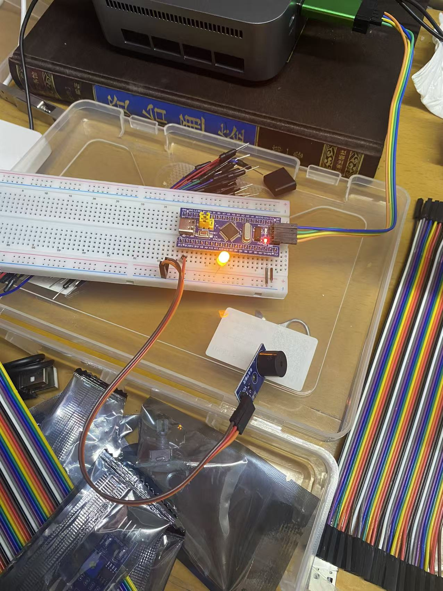

# Day 03 - 蜂鸣器学习笔记

> 学习日期：2026-07-14

## 蜂鸣器

### 1：源码学习
// --- 在 main 函数前面定义这个简易延时函数 ---
/**
  * @brief  简易阻塞式延时函数（通过空循环实现）
  * @param  ms ：要延时的毫秒数（近似值，需根据系统时钟调整循环次数）
  * @retval 无
  * @note   使用 volatile 关键字防止编译器优化掉循环体，
  *         循环次数 8000 适用于 72MHz 系统时钟（约 1ms），
  *         实际延时需用逻辑分析仪或示波器校准。
  */
void delay_ms(unsigned int ms) 
{
    volatile unsigned int i, j;  // volatile 强制每次循环从内存读取，防止被优化
    for(i = 0; i < ms; i++)
        for(j = 0; j < 8000; j++); // 空转延时（数字8000可调，越大延时越久）
}
/**
  * @brief  主函数
  * @param  无
  * @retval int（嵌入式环境下通常不返回）
  */
int main(void)
{
    /*------------------ 1. 使能 GPIOB 外设时钟 ------------------*/
    // RCC_APB2PeriphClockCmd 是标准库函数，用于开启或关闭 APB2 总线上的外设时钟。
    // 参数1：指定要操作的外设（这里选择 GPIOB），可以多个组合（用 | 连接）
    // 参数2：ENABLE 开启时钟 / DISABLE 关闭时钟
    // 注意：任何 GPIO 操作前必须使能对应端口的时钟，否则寄存器无法写入/读出。
    RCC_APB2PeriphClockCmd(RCC_APB2Periph_GPIOB, ENABLE);
    /*------------------ 2. 定义并填充 GPIO 初始化结构体 ------------------*/
    // GPIO_InitTypeDef 是标准库中定义的 GPIO 配置结构体类型，
    // 用于集中存放一个或多个引脚的模式、速度、上下拉等配置信息。
    GPIO_InitTypeDef GPIO_InitStructureB;
    // 配置 GPIO_Mode ：设置为推挽输出模式（Out_PP）
    // 推挽输出可以输出高电平和低电平，驱动能力较强。
    GPIO_InitStructureB.GPIO_Mode = GPIO_Mode_Out_PP;
    // 配置 GPIO_Pin  ：选择要配置的引脚，这里选择 PB1（对应位1）
    // 可以使用 GPIO_Pin_0 ~ GPIO_Pin_15 或组合（如 GPIO_Pin_0 | GPIO_Pin_1）
    GPIO_InitStructureB.GPIO_Pin = GPIO_Pin_1;
    // 配置 GPIO_Speed：输出速度等级，这里设置为 50MHz
    // 速度越高，信号边沿越陡，但功耗也略大，按需选择。
    GPIO_InitStructureB.GPIO_Speed = GPIO_Speed_50MHz;
    /*------------------ 3. 调用 GPIO_Init 函数完成硬件配置 ------------------*/
    // GPIO_Init 是标准库的 GPIO 初始化函数，根据结构体内容写入硬件寄存器（CRL/CRH）。
    // 参数1：指向 GPIO 外设基址（GPIOB），
    // 参数2：指向填充好的配置结构体。
    // 该函数会遍历 GPIO_Pin 中指定的引脚，分别配置对应的 CRL/CRH 位，
    // 并根据模式（如上拉/下拉）设置 ODR 寄存器以启用内部电阻。
    GPIO_Init(GPIOB, &GPIO_InitStructureB);
    /*------------------ 4. 主循环：PB1 以 200ms 间隔闪烁 ------------------*/
    while(1) 
    {
        // GPIO_ResetBits ：将指定引脚输出低电平（0V）
        // 对于 PB1，输出低电平 → LED 亮（假设 LED 负极接 PB1，正极接 VCC）
        GPIO_ResetBits(GPIOB, GPIO_Pin_1);
        delay_ms(200);                    // 保持亮约 200ms
        // GPIO_SetBits   ：将指定引脚输出高电平（3.3V）
        // 对于 PB1，输出高电平 → LED 灭
        GPIO_SetBits(GPIOB, GPIO_Pin_1);
        delay_ms(200);                    // 保持灭约 200ms
    }
}
GPIO_WriteBit：可以手动设置：高低电平
GPIO_ResetBits：只能设置低点平
口诀：
RCC_APB2PeriphClockCmd：可以开启多个：打开电源
GPIO_InitTypeDef：定义结构体：包含：模式，频率(可以多个)，引脚
GPIO_Init：开启外设

